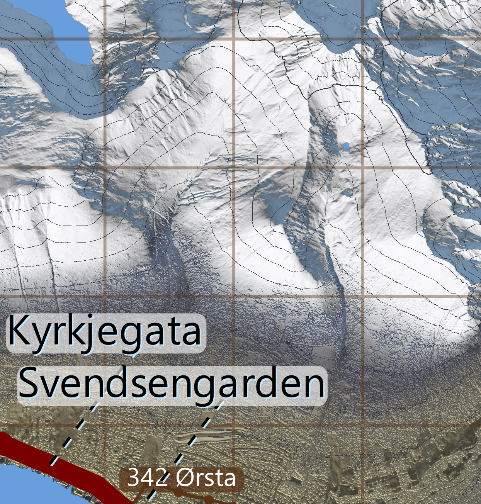
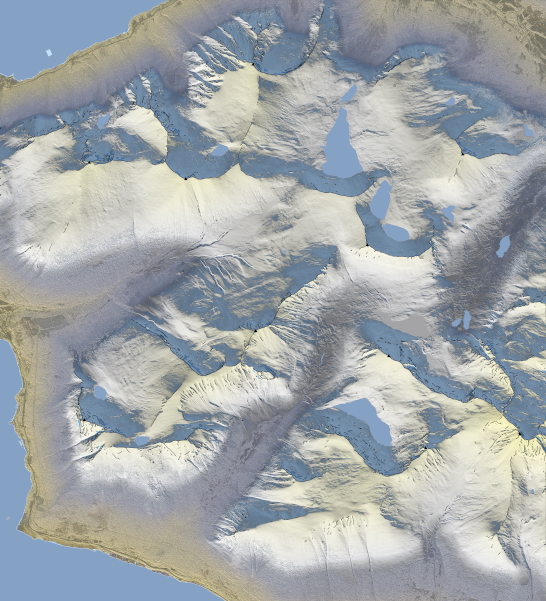
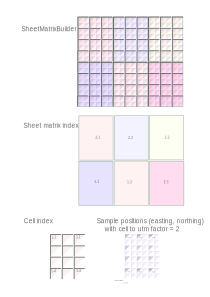

# BitmapMaps.jl
Make topographic relief bitmaps for printing from 32-bit elevation data, overlain with vector graphics. No need for purchased software.

# What does it do?

Make printable topographic relief maps with text overlay presented in .svg format. Input is .tif files [downloaded](https://hoydedata.no/LaserInnsyn2/) in a resolution of 1x1 m, buildings and vegetation included. This means we can identify terrain features like forest, settlements and lakes. 

Output resolution is typically less dense. For example, the image below is in 2x2 m output resolution. The 1x1 m resolution covers all of Norway and is freely licensed. 



# Features

Change the font size and mostly anything else using a text editor and file `BitmapMaps.ini`. A template with comments will be made and placed in your home directory.

You could manually edit intermediate images ('Markers.png', 'Grid.png' or 'Lakes.png'), or text files ('Summits.csv', 'Lakes.csv'). They are all generated by running `run_bitmapmap_pipeline()`. After making changes, just re-run the pipeline and your changes will be incorporated in the result, 'Composite.svg'. 

The [hypsometric](https://en.wikipedia.org/wiki/Hypsometric_tints) colours resemble a clear, early afternoon in mid-February at 62°N, with snow cover above 500 m. The low sun has slightly warm colours, while three skylights have a more bluish tint from the clear sky. The colours are hard-coded, and the algorithm inspired by [PerceptualColorMaps.jl](https://github.com/peterkovesi/PerceptualColourMaps.jl/blob/master/src/relief.jl).

Elevation contours are smoothed in rough areas like forests or between buildings. Elsewhere, they are exact.

Water surface is identied from local flatness and roughness, and is overlain in blue. You can edit 'Lakes.csv' to add names to elevations. Distinguishing between moor and lake is difficult; you may want to manually edit the input files, threshold values in `BitmapMaps.ini`  or the resulting outline in `Lakes.png`.

Summits are marked in text files and in 'Markers.png'. Summit candidates are identified from [surface curvature](https://en.wikipedia.org/wiki/Curvature#Curves_on_surfaces) and filtered out by [summit prominence](https://en.wikipedia.org/wiki/Topographic_prominence). Surface curvature helps filter out trees, masts and other local maxima. Prominence considers all the sheets included in a regional map, so a final value can only be found after pre-processing all the map sheets. For candidates with prominence above the threshold (40 m by default), we fetch names from `Stadnamn.jl`. We suggest you edit 'Stadnamn.ini' in your home folder where online names are insatisfactory.

Ridges ('outside corners', clifftop edges) and dieders ('inside corners', creeks, cliff bottom edges) are marked in `ridges.png` as dark or blue lines. They are found from curvature, and the thresholds are of course configureable.

For navigating between sheets for inspection, we make a mosaic of sheets. It is zoomed out so as to also fit on a printed sheet or in a browser. Details are removed, so it looks more like this image:



For better panning, zooming and navigation: Copy `resource/Index.html` into your project folder, and rename the variable `defaultSvgFile` to your .svg file in that same folder. We suggest serving with [LiveServer.jl](https://juliadocs.org/LiveServer.jl/dev/). This page automatically loads library [Panzoom](https://github.com/timmywil/panzoom).


# Installation

In Julia v1.9+:

```julia
pkg> registry add https://github.com/hustf/M8
pkg> add BitmapMaps
```


# Example

Running the example will generate `BitmapMaps.ini`, which is human readable and editable.

```
julia> using BitmapMaps

julia> ENV["JULIA_DEBUG"] = "BitmapMaps" # For step-by-step feedback

julia> run_bitmapmap_pipeline()
```

If you're running this from VSCode, many intermediate images will be displayed right after they are made.

Functions are generally documented inline.

# Pipeline for making a regional map

After downloading relevant .tif files, the regional map is made step-by-step in a 'pipeline'. If, say, some elevation input files are missing, the pipeline will of course stop. But, should you choose to, you can do every step on all sheets before proceeding:

```
julia> run_bitmapmap_pipeline(; complete_sheets_first = false)
```

Each step produces files, and re-running the pipeline will re-use such files unless you delete them. If you edit intermediate files, re-running the pipeline will pick those changes up and incorporate them in later steps.

The end result is one vector graphics (.svg) file per sheet, as well as the mentioned mosaic for navigation on-screen. Although the intended end purpose is printing on paper, you can open the .svg files in a browser or an editor.  We suggest keeping the mosaic / tile overview open, and refresh to show freshly processed tiles. The overview or regional map is linked to the sheets, you can inspect individual sheet files as they are being made.

Rendering the finished bitmaps is not realistically expected to run in one step. This is more likely:

- User step 1: `run_bitmapmap_pipeline()`. If not existing already, a default `BitmapMaps.ini` file is created in your home directory. User defines the map by updating arguments in that file (recommended) or by passing keywords to the pipeline. Keyword arguments will over-rule those in the .ini file. Hint: Use online tools for WKT-text to fine tune the geographic placement of sheets.
- User step 2: Move relevant elevation data (.zip or .tif-files) into user's project folder. It may cover a larger area. Update 'BitmapMaps.ini' file with this location.
- User step 3: `run_bitmapmap_pipeline()` again. If the input files are found, subfolders containing a sheet each will be generated. A dictionary (an index, rather) of input files and their contents will be generated and saved, because we want to avoid unnecessary opening and closing of large input files.
- User step 4: Enjoy. Or print to paper and enjoy.

Steps in the pipeline are :

1) Define a specification object for the regional map, a `SheetMatrixBuilder`. Print Repl feedback for a preview of the bitmap's geographical extent and division into sheets (`define_builder`). If you call `smb = define_builder()` directly, 
you can check details,  or details for individual sheets (e.g. `smb[2, 2]`)

0) Pre-process: Make an .svg file which links to each sheet. You can open this in a browser. At first, it will contain empty rectangles for each sheet. Later, thumbnails of each sheet are shown (`make_vector_graphics`). Click on a thumbnail to navigate to that sheet.


1) Define a `SheetMatrixBuilder` for the regional map (`define_builder`), and print a summary to the REPL. 
    Its properties are taken from `BitmapMaps.ini`, which can be overruled by keyword arguments.

2) Make an .svg file which links to each sheet (`make_vector_graphics(smb)`). You can open this in a browser. At first, it will contain empty rectangles for each sheet, reload to update
while the sheets are bein made. Click on a thumbnail to navigate to that sheet.

The following steps are functions called with a `SheetBuilder` argument. A `SheetBuilder` is a subdivision of a `SheetMatrixBuilder`.

3) Establish a folder (`establish_folder`).

4) Unzip elevation data (`unzip_tif`) from the project folder.

5) Consolidate elevation data (`consolidate_elevation_data`), i.e. copy elevation data from input .tif files to a smaller .tif file in a sheet's folder. 

6) Identify water surfaces (`water_overlay`).

7) Make topographic reliefs (`topo_relief`), that is, the colorful bitmap without other details.

8) Make elevation contours (`contour_lines_overlay`).

9) Add UTM grid (`grid_overlay`). Typically, the local UTM zone is overlain, while the map projection follows the countrywide UTM zone.

10) Mark ridges and dieders (`ridge_overlay`).

11) Make a preliminary summit identification (`summits_on_sheet`), write to a preliminary text file and summit markers image. 
    Also add the sheet local elevation graph to the regional elevation graph. See description below.

12) Make a composite bitmap from layers (`join_layers`), 'Composite.png'. This will be an external resource to step 15, which overlays text on top of the bitmap.

13) Make a smaller composite bitmap (`make_thumbnail`), without grids and contours. This will be an external resource to `(name varies).svg', the mosaic of all sheets created in step 2. 

The following steps are run only after 1-13 is complete for all sheets:

14) Update files with summit prominence (`summits_regional_update`). From prominence, reduce the list of summits. Retrieve geographical names (indirectly, `Stadnamn.jl` makes the calls). Update the `Summits.csv' text files and the preliminary 'Markers.png'. Replace preliminary markers symbols. By default we use filled triangles for peaks with prominence > 100 m.

15) Call `make_vector_graphics`. Step 2 already did this for the regional map. We now make `Composite.svg` files for individual sheets. You can navigate here using the browser from the regional map. 

16) Re-make the composite bitmap (`join_layers`) if `Markers.png` was updated in step 14. 


# Current state

Version 0.3.4-6:
Bugfix: Uncomment `smooth_laplacian`.
Bugfix: retry_write with EzXML.

Version 0.3.3:
Configuration file directory can now be specified with environment variable BMM_CONFDIR.

Version 0.3.2:
Add `resource/Index.html`.
Modify .svg links to use `/` instead of `\`.

Version 0.3.1:
Add detailed reporting for summit prominence checking.
Add detailed feedback for water body identification at specific coordinates.
Add utilties for touching up elevation files manually with the open-source Gimp editor.
Add parameters for disabling online retrieval of geographical names, due to discovered throttling.
Use version "0.9.4" of GeoArrays. 
Improve speed by using static arrays and dropping support of 'Missing' values in consolidated elevation files.


Version 0.3.0:
Rework water detection fundamentally. This approach detects most artifacts and colors those as water if close to
a water body. Manual artifact removal is now not necessary in most cases. In steps:
  a) Identify water candidate segments by local steepness.
  b) Disqualify candidate segments which have too large elevation difference. The criterion scales with bounding box diagonal of    each segment
  c) Identify artifact segments. Join with candidates to make water segments.
  d) Disqualify water segments not meeting the area requirement.

Add utm position of water bodies to 'Water.csv'.

Version 0.2.1:
Do not draw ridge lines on the borders of sheets.

Version 0.2.0:

Rework prominence calculation, since the previous algorithm was incorrect in some cases and required multiple pipeline runs. See description below.

Step 13 now requires more arguments than just the sheet builder to step 13. Instead of adding more fields to `SheetBuilder`, we made closure functions in the calling context (`process_job`).
The new step `make_thumbnail` also needed more information. Rather than adding more fields to `SheetBuilder` we made closure functions in the calling context.
These closures have the downside that user can not as easily call individual steps in the pipeline.

Making a meaningful and unit full test suite is difficult, real tests requires a large and varied data set. We're now working with 'devolop' test files, which fast become
irrelevant as small issues are solved. We're not committing those files at this point, and in the future the ambition to test the full codebase in CI should simply be dropped.

Version 0.1.13:

 - Use small font for alternative name and for summit prominence.

Version 0.1.12:

 - Moved name-selection functionality to new revision of 'Stadnamn.jl'.

Version 0.1.11:

 - Add step 2, an overview file placed in the project directory.

Version 0.1.10:

 - Improved forest detection
 - Improved contours and ridges. All forest is assumed to have a height offset of 4.0 metres.
 - Generalized FIR filtering
 - A dictionary of geoarray files is now saved to the project path, speeding up consolidation
 - Testing of contours, filters and ridges is in a temporary state
 - Identification of bumpy patches is done twice, for contours and for ridges. Time consuming.

Version 0.1.9:

 - Add forest detection and smooth contours in such areas.
 This is in a temporary state. Currently, all forest is assumed to have a height offset of 4.0 metres.
 We consider using 'forest height' as an identifier of forests instead. If that does not work well, we
 might want to revert to this version.

Version 0.1.8:

- Add feedback for every sheet processed.
- Prepare and optimize an algorithm for identifying forest areas.

Version 0.1.7:

- Change topographic relief to XYZ colorspace.
- Revise palette to lighter colors
- Modify `shade_exponent` and make it direction dependent
- Add keyword argument `skip_summits`, for faster pipeline iterations

Version 0.1.6:

- Add .ini parameter 'Behaviour when data is missing', for sheets completely filled with water surface.
- Use a temporary dictionary for storing non-zero boundary boxes for input files.

Version 0.1.5:
 - change the palette to have a more uniform lightness, and an increasing red-yellow-ish tint between altitudes 500 m and 1500 m. Also change from using the colorspace RGB to XYZ while
 generating the palette. The topographic relief may look better if we complete that transition,
 because lightness is linear in XYZ.
 - Introduce 'recurse' keyword to the utilty function `copy_sources_into_destination`.
 - Accept 'missing' values in geoarray files.
 - For files with only zeros or 'missing' values, the Well-Know-Text feedback now shows a diagonal. 

   Example for multiple files:
```
julia> fnas = filter(n -> endswith(n, ".tif"), readdir());

julia> polygon_string(fnas[1:3]) |> println
MULTIPOLYGON (
                   ((-54575 6875995, -39565 6875995, -39565 6891005, -54575 6891005, -54575 6875995)),
                   ((-40758 6875995, -39565 6875995, -39565 6881141, -40758 6881141, -40758 6875995)),
                   ((-54575 6890995, -39565 6890995, -39565 6906005, -54575 6906005, -54575 6890995)),
                   ((-54575 6890995, -54574 6890995, -39566 6906005, -39565 6906005, -54575 6890995)),
                   ((-39575 6875995, -24565 6875995, -24565 6891005, -39575 6891005, -39575 6875995)))
```

Or, for single files:

```
julia> show_derived_properties(fnas[1])
        
        [easting, northing] derived properties:
          Bounding Box (BB) SE-NW            = (-54575 6875995)-(-39565 6891005)
          Northeast internal corner          = (-39566.0, 6.891005e6) - most northeastern sample point
          Geo centre                         = (-47070.0, 6.8835e6)
          Grid centre single                 = (-47070.0, 6.8835e6)
        Derived properties:
          Geographical (width, height) [km]  = (15.0, 15.0)
          Geographical area [km²]            = 225
          Distance between cells [utm or m]  = 1.0
        External and zero-padded boundary box as Well Known Text (paste in wktmap.com or nvdb-vegdata.github.io/nvdb-visrute/STM ):
          MULTIPOLYGON (
                   ((-54575 6875995, -39565 6875995, -39565 6891005, -54575 6891005, -54575 6875995)),
                   ((-40758 6875995, -39565 6875995, -39565 6881141, -40758 6881141, -40758 6875995)))
```


## General
`GeoArrays.jl` has breaking changes in  version 0.9 (we currently pin to 0.8.5). It could be fixed easily.

Some nice to know:

- Metadata for printing is made and stored in .png files. Settings are respected by e.g. `Gimp`, `MS Paint`, and `IrFanview`.
- Water surfaces often require manual touch-up. Try doing sea-level touch up in 'Consolidated.tif', or in your source data .tifs. High elevations can also be shown (reduced to 256 intensities in Gimp) by adding a temporary 'division mode' layer.
- The UTM grid is the correct one for the local utm zone, even though data is from a country-wide zone. We might in the future add local UTM grid coordinates to summits as a tooltip.
- Sheet numbering starts in the SW corner. See figure:



# Bounding box functions
 
Bounding boxes have meaning for:
   - GeoArrays (this type is defined by `GeoArrays.jl`)
   - file names referring GeoArrays
   - SheetMatrixBuilder and SheetBuilder (this package's main types)

If you're inspecting your own job definitions, you may only need `show_augmented(smb)`.

`show_derived_properties` shows the interesting properties for file names and other types.
You may find `polygon_string` or `bbox_external_string` more useful for optimizing placement.

Why not just use `GeoArrays.bbox` and `GeoArrays.bbox_overlap`?
   - Two adjacent map sheets shares a boundary (x_max1 == x_min2), but do not overlap. In `GeoArrays.bbox_overlap`, two such boxes do overlap, because x_max1 refers a cell and not it's right edge.
   - In this package, UTM coordinates are integers (because that resolution is liberally licensed for all of Norway, and because we use folder names corresponding to external boundary boxes). GeoArrays.jl uses floating point numbers.
   - A sheet in a map book is naturally defined by its boundary. Such a boundary does not change with cell resolution or data density.
   - Downloaded elevation files may be zero-padded. We are mostly interested in the non-zero geographical region.
   - Rasters aren't simply matrices. Word definitions and conventions come from various professions.
   - When working with online map tools, we like to paste Well-Known-Text polygons.


First, you do the main work in downloading elevation data in your chosen folder, e.g. `your_homedir/BitmapMaps/your_project`. As mentioned, [data](https://github.com/peterkovesi/PerceptualColourMaps.jl): https://hoydedata.no/LaserInnsyn2/


# Summit identification and prominence calculation

This describes the algorithm from version 0.2.0.

## Input, elevation matrix z

We start with individual sheets. We have the dense elevation matrix z, with element type Float32. It has thousands of local maxima, and we have a mapping from each pixel to a geographical position in the local utm coordinate system. We always use the highest resolution here: Even if we're only going to make an output image with lower resolution, the z matrix has cells with sides 1x1 m. If we did not, we could not reliably and consistently identify summits.

## The maxtree

From matrix `z`, we calculate the `maxtree` with a function from ImageMorphology. That is a graph which we will describe presently, but formatted in a very effective way. We are able to do this from a matrix with a few thousand rows and column, but we would not be able to do it for a regional map - that might take hundreds or thousands of gigabytes of memory and a lot of time.

The maxtree can be described like this:
   - A directed acyclic graph
   - Stored very effectively as dense matrices in a single MaxTree type
   - A tree rooted at sea level (black pixels, or pixels with value 0f0)
   - A spanning tree, with one vertex per pixel in z
   - A component tree. This is because we chose to round elevations in z to whole metres. Nearby
     pixels or vertices with the same elevation (due to round-off) comprise one component.
   - An arborescence
   - An outtree
   - A hierachy where each vertex has a single incoming edge

## Candidates from maxtree and z

Using this local graph, we can pull out interesting subtrees and represent them in a different form. We'll be coming to that form. 

First, we identify as summit candidates`distinct_summit_indices` from the maxtree. Remember that we rounded off z-values in order to make this a component tree? A distinct summit index is the tallest member in a descendant-less component, i.e. the tallest point in a local maximum component.

Second, we drop any summit candidates with elevation < 200 m. Those are not summits, and uninteresting to us now.

## Candidates eliminated based on their curvature

Third, candidates must fall within a curvature range. This effectively eliminates a lot of power lines and trees. Let's just define curvature first:

### Curvature definition

The partial derivatives of cell elevation values with respect to rows and columns comprise the local gradient (g1, g2), often called the Jacian components. We actually implement this with 'Bickley' kernel factors for practical reasons. We then differentiate (g1, g2) once more with respect to the same directions, and we have (g11, g22).

So what we call 'curvature' is actually

    (g11 + g22) / 2

The same expression is used in most engineering disciplines under various names. For example, vector calculus itself, fluid dynamics, material stress and strain analysis, chemistry and biology. We had various analogies in mind when coding, so in the comments you could find some inconsistent terminology.

# Prepare for prominence calculation

Even after filtering many candidates out, we have thousands of potential summits per sheet. The next step is calculating a local summit prominence for all, and filtering out those with too low values. The logic goes like this:

- Summit A (200 m) and B (100 m) are neighbours connected by a saddle point or col at 70 m. They are also connected to unknown mountains outside of the sheet. 
=> From B you can go downhill only from B to the saddle point, 30 m below. Going uphill only you can reach A, which is taller than B. B has a prominence value   candidate of 30 m. 
=> The actual prominence of B is 30 m, and the actual prominence cannot be higher. 
=> If we have a prominence criterion of 40 m (the default), we can safely eliminate B.

In order to do the local and preliminary filtering above, we'll use a local elevation graph with just the info we need and no more.

## Re-form what we have to a local elevation graph

- Form a directed metagraph. That is, a graph where each vertex has a label and a property.
- From our still very long list of summit candidates, take all indices into the matrix z.
- Each index in the matrices map to an utm coordinate. Use the utm coordinate as a label. This is necessary for combining multiple sheets later.
- Each index in the matrixes point to an exact elevation. This will be our vertex property.
- Follow all ascendants of our candidates in the maxtree. Add those, along with edges between.

At this point, we can start at any leaf, walk towards ascendant, which is downhill. There is no point point in walking further if we reach
40 m (example). At branching vertices, follow all other paths upwards to look for vertices taller than the starting leaf. If we find one, the branch with the starting leaf can be pruned.

We prepare for connecting the graph to neighouring graphs from other sheet. Along the borders of the sheet which will have neighbours, add vertices for every utm coordinate. Also add all descendant and ascendants of these vertices. 

Finally, simplify the local graph by iteratively: 
- Chain reduce by removing vertices with one in-edge and one out-edge
- Prune by local prominence
- Protect branches touching the coming borders to neigbors


## Build a connected, regional graph

Connecting two sheet local graphs potentially creates loops and other issues. Having established potential pairs of vertices to connect graphs, we are able to avoid the pitfalls by following these rules:

- Do not connect vertices on corners, connect sides to sides only
- If both vertices are at zero elevation, don't connect
- If rounded elevations differ, connect lower to higher. And vice versa
- If rounded tallest elevation above is higher, connect to that vertex. And vice versa
- If lowest elevation below is lower, connect from that vertex. And vice versa
- If none of the above, don't connect

The graphs to be connected are already copied to regional elevation graph.

Whenver the regional graphs are rectangular, we define which sides are protected, and apply the same iterative simpification as above. 
The larger such a graph grows, the more summits can be determined to fall below the prominence level, which means we can prune it.

Although we have no formal proof for the procedure, it seems to work well, and it allows for very large elevation graphs. 
When the regional graph is complete, we calculate promninence for all leafs. For some regions, prominence will need to be manually adjusted 
for the very tallest peak in the region.
