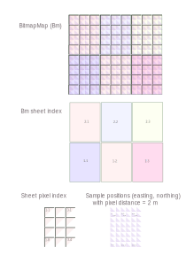

# BitmapMaps.jl
Make topographic relief bitmaps for printing from 32-bit elevation data, overlain with vector graphics

# What does it do?

Make printable topographic relief maps. The foreground is vector graphics from [RouteMap.jl](https://github.com/hustf/RouteMap.jl),
and the background is topographic relief maps based on elevation data. The hypsometric colours resemble a clear, early afternoon in 
mid-February at 62°N, with snow cover above 500 m.

This example uses laser elevations with a 3 metre spacing. Publicly available data covers all of Norway with a spacing of just 1 metre.
We could potentially zoom in to the street level.

The example includes default elevation contours every 100 m with a fatter curve at 1000 m. The map projection is, unusually, follows the UTM grid, which is shown with 1 km spacing.

# How does it do it?

Rendering the finished bitmaps is not expected to run in one go. Intermediate step results are saved in a folder structure defined in an .ini file. The .ini file is generated automatically, but can be updated by user.

If an intermediate file is deleted, the corresponding step is triggered to rerun.
Steps include:

1) Define a `BmPartition` based on `home/BitmapMaps.ini`. Keywords overrule file values. Repl feedback for a 'preview'.
2) Establish folder hierarchy for storing intermediate data.
3) User action if missing: Make requests for public data at høydedata.no (requires email). Download to appropriate folders.
4) Unzip downloaded .zip files
5) Consolidate elevation data.
6) Identify water surfaces.
7) Make topographic reliefs
8) Make elevation contours
9) Make vector graphics and text covering the full map area. You may use RouteMap.jl for this step.
10) Make composite bitmaps: 
    - topographic reliefs 
    - water surfaces
    - elevation countours 
    - vector graphics and text

# Current state
Debugging 5). Code copied from environment 'geoarrays' and in package 'RouteMap.jl' ' / example/ split '.

A first map was made with scripting, ad hoc calculations and A4 sheets.

Some changes from scripting workflow:

- Establish BitmapMaps.ini, tune default printer data (the scripted / manual workflow map was missing 1 mm due to 'random' variations during printing).
- Find a reliable way to print with actual scale. Use png's pHYs chunk, then print with an application that respects the settings. E.g. Gimp, MS Paint, and IrFanview.
- Introduce the BmPartition (outer iterator) and SheetPartition (inner iterator for pixels). Change sheet numbering to start in SW corner. See figure:

