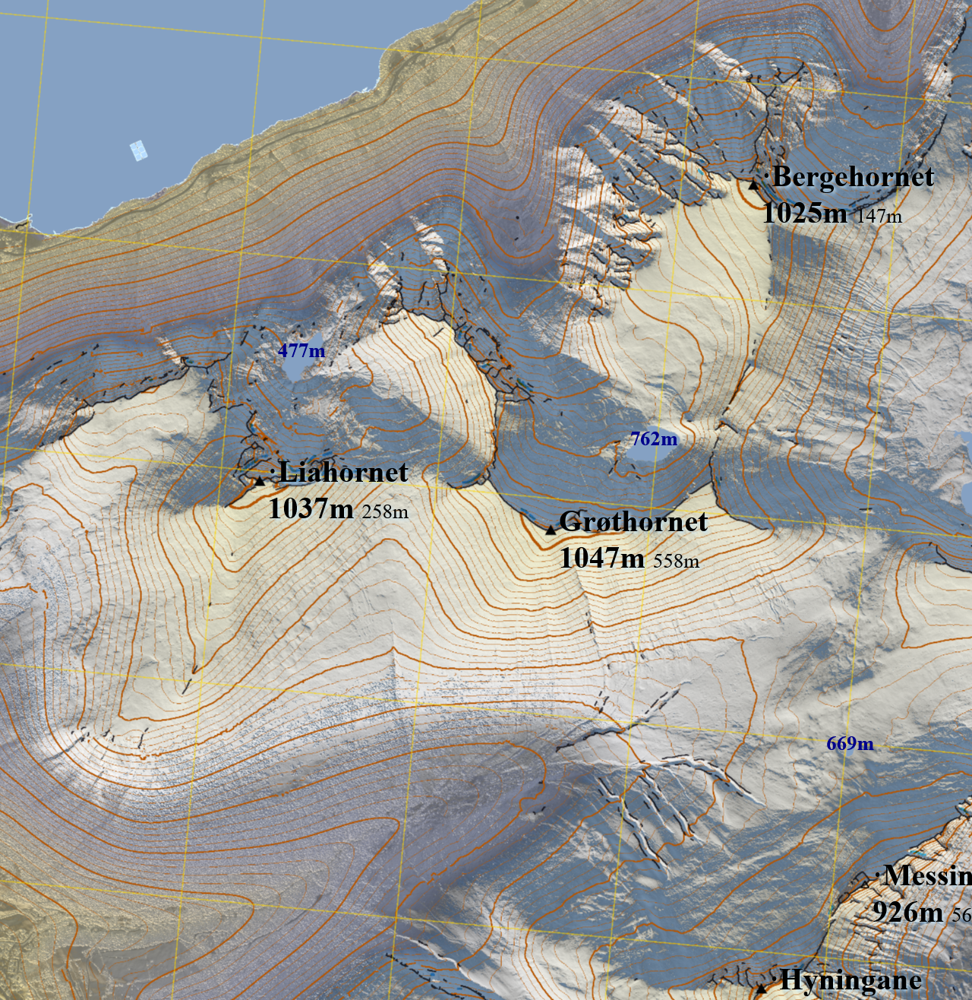

# BitmapMaps.jl
Make topographic relief bitmaps for printing from 32-bit elevation data, overlain with vector graphics


# What does it do?

Make printable topographic relief maps. The foreground is vector graphics from [RouteMap.jl](https://github.com/hustf/RouteMap.jl),
and the background is topographic relief maps based on elevation data. The hypsometric colours resemble a clear, early afternoon in 
mid-February at 62°N, with snow cover above 500 m.

This example uses laser elevations with a 3 metre spacing. Publicly available data covers all of Norway with a spacing of 1 metre or less,
so we could potentially zoom in to the street level. Both surface (with trees and houses) and terrain (cleaned of such) are available.



The example includes default elevation contours every 100 m with a fatter curve at 1000 m. The map projection,, unusually, follows the UTM grid, which is shown with 1 km spacing.

# How does it do it?

Rendering the finished bitmaps is not expected to run in one step. As a minimum:
- Step 1: `run_bitmapmap_pipeline()` => A folder hierarchy is established.
- Step 2: User moves in elevation data. This may help: `copy_relevant_tifs_to_folder(source_folder, destination_folder)`
- Step 3: `run_bitmapmap_pipeline()` => User inspects rendered images.

An .ini file is generated with default argument values. User updates arguments in the file (recommended) or by passing keywords to the pipeline.

If an intermediate file is deleted, the corresponding step is triggered to rerun - if an output file exists, the corresponing and the previous steps are skipped.

Steps in the pipeline, in sequece:

1) Define a `SheetMatrixBuilder` based on `home/BitmapMaps.ini`. Keywords overrule file values. Repl feedback for a preview of the bitmap's geographical extent and division into sheets (`define_builder`).
2) Establish folder hierarchy for storing intermediate data (`establish_folder`).
3) User action if missing: 
  - Make requests for public data at høydedata.no (requires email). Download to each sheet's folder.
  - Or, if data exists locally: `copy_relevant_tifs_to_folder`
4) Unzip elevation data (`unzip_tif`).
5) Consolidate elevation data (`consolidate_elevation_data`).
6) Identify water surfaces (`water_overlay`).
7) Make topographic reliefs (`topo_relief`) from a hardcoded hypsometric colour pallette.
8) Make elevation contours (`contour_lines_overlay`).
9) Add UTM grid (`grid_overlay`).
10) Mark dieders and ridges (`ridge_overlay`).
11) Make vector graphics and text covering the full map area. 
12) Composite bitmap and vector graphics (`join_layers`).

# Example
```
using BitmapMaps
smb = run_bitmapmap_pipeline(;complete_sheets_first) # This makes a default .ini and establishes all folders
copy_relevant_tifs_to_folder("yourpath", smb)
run_bitmapmap_pipeline()
```
# Current state

Code has been adapted from environments 'geoarrays' and 'tutorial_images, as well as package 'RouteMap.jl'. Step 11 is currently missing. The
previous version used LuxorLayout for this, but the svg's are in practice uneditable. Linking bitmaps from 'self-produced' svgs may be a better option overall.

`GeoArrays.jl` has breaking changes in  version 0.9 (we currently pin to 0.8.5). Cairo / Pango has long-standing font issues on Windows, we currently pin the version. We could use Inkscape, but it seems to be affected as well.

Some of the changes from scripting workflow:

- Configurations stored in BitmapMaps.ini.
- Printing metadata is made and stored in .png files. Settings are respected by e.g. `Gimp`, `MS Paint`, and `IrFanview`.
- Water surfaces are found with a new algorithm. Manual corrections will hopefully be less of a requirement.
- The colour palette is FixedPointNumbers.Normed{UInt8, 8}, not Float64 - based.
- Topographic relief is rendered faster with `ImageFiltering.mapwindow`.
- Step 5, 'consolidation' stores an inspectable .tif file.
- The SheetMatrixBuilder and SheetBuilder types are more flexible than storing specifications in folder names. 
- The pipeline can reuse `SheetMatrixBuilder` and modify it by steps, using keywords.
- Ridge lines and dieder (inward corner) lines. 
- The UTM grid is the correct one for the local zone. 
- Change sheet numbering to start in SW corner. See figure:


# Wishlist (after version 0.1)

- Side-by-side overview of all sheets
- Show correct grid for the area, e.g. UTM32.
- Mark maxima, use prominence. Editable text file for peaks? Add peak labels in .svg?

# Bounding box functions

Bounding boxes have meaning for:
   - GeoArrays (this type is defined by `GeoArrays.jl`)
   - file names referring GeoArrays
   - SheetMatrixBuilders (this package's main type)
   - SheetBuilders (this package's main type)

If you're inspecting your own job definitions, you may only need `show_augmented(smb)`.

`show_derived_properties` shows the interesting properties for file names and other types.
You may find `polygon_string` or `bbox_external_string` more useful for optimizing placement.

Why not just use `GeoArrays.bbox` and `GeoArrays.bbox_overlap`?
   - Two adjacent map sheets shares a boundary (x_max1 == x_min2), but do not overlap. In `GeoArrays.bbox_overlap`, two such boxes do overlap, because x_max1 refers a cell and not it's right edge.
   - In this package, UTM coordinates are integers (because that resolution is liberally licensed for all of Norway, and because we use folder names corresponding to external boundary boxes). GeoArrays.jl uses floating point numbers.
   - A sheet in a map book is naturally defined by its boundary. Such a boundary does not change with cell resolution or data density.
   - Downloaded elevation files may be zero-padded. We are mostly interested in the non-zero geographical region.
   - Rasters aren't simply matrices. Word definitions and conventions come from various professions.
   - When working with online map tools, we like to paste Well-Known-Text polygons.
